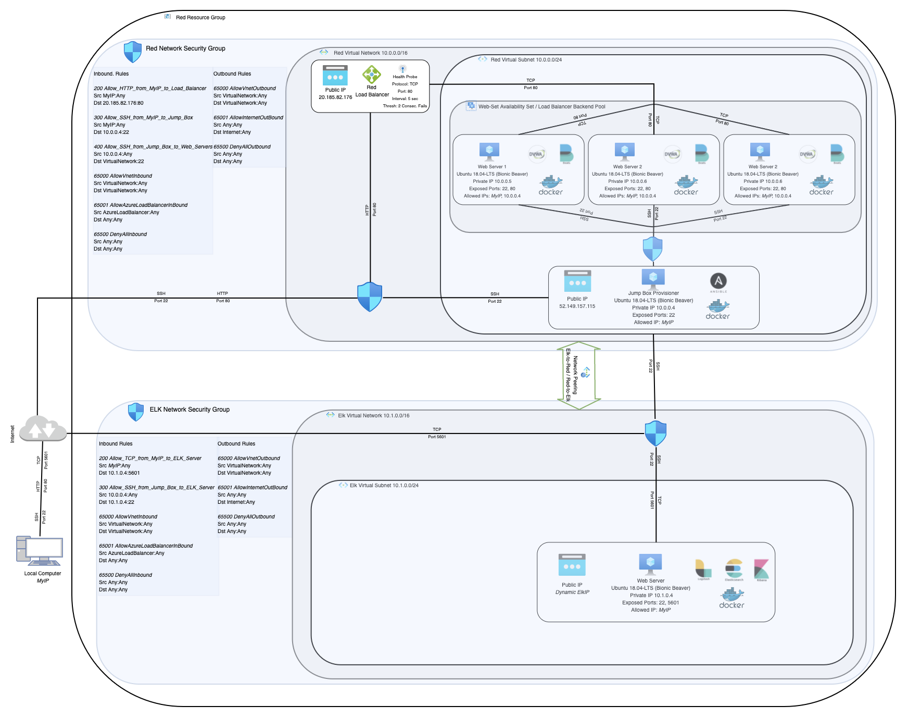
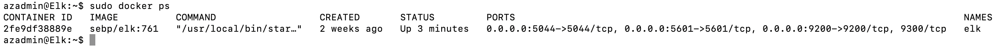

## Automated ELK Stack Deployment

The files in this repository were used to configure the network depicted below.

These files have been tested and used to generate a live ELK deployment on Azure. They can be used to either recreate the entire deployment pictured above. Alternatively, select portions of the Ansible files may be used to install only certain pieces of it, such as Filebeat.

This document contains the following details:
- Description of the Topology
- Access Policies
- ELK Configuration
  - Beats in Use
  - Machines Being Monitored
- How to Use the Ansible Build

### Description of the Topology

The main purpose of this network is to expose a load-balanced and monitored instance of DVWA, the D*mn Vulnerable Web Application.

Load balancing ensures that the application will be highly responsive and resilient, in addition to restricting access to the network.

Integrating an ELK server allows users to easily monitor the vulnerable VMs for changes to the log files and system performance.

The configuration details of each machine may be found below.
  - _Note: Use the [Markdown Table Generator](http://www.tablesgenerator.com/markdown_tables) to add/remove values from the table_.

| Name         | Function                                       | IP Address   | Operating System                 | Applications                           |
|--------------|------------------------------------------------|--------------|----------------------------------|----------------------------------------|
| Jump Box     | Controlled Access & Provisoning                | 10.0.0.4 / 52.149.157.115 | Ubuntu 18.04-LTS (Bionic Beaver) | Docker, Ansible                        |
| Web Server 1 | Store, Process, Deliver Web Pages & Redundancy | 10.0.0.5     | Ubuntu 18.04-LTS (Bionic Beaver) | Docker, DVWA, Beats                    |
| Web Server 2 | Store, Process, Deliver Web Pages & Redundancy | 10.0.0.6     | Ubuntu 18.04-LTS (Bionic Beaver) | Docker, DVWA, Beats                    |
| Web Server 3 | Store, Process, Deliver Web Pages & Redundancy | 10.0.0.7     | Ubuntu 18.04-LTS (Bionic Beaver) | Docker, DVWA, Beats                    |
| Load Balancer| Load Balancing between the 3 Web Servers       | 20.185.82.176| Ubuntu 18.04-LTS (Bionic Beaver) | Docker, Logstash, Easticsearch, Kibana |
| ELK Server   | Logging & Monitoring                           | Dynamic ElkIP| Ubuntu 18.04-LTS (Bionic Beaver) | Docker, Logstash, Easticsearch, Kibana |

### Access Policies

The machines on the internal network are not exposed to the public Internet. 

Only the Jump Box, Load Balancer and Elk Server machines can accept connections from the Internet. Access to these machines is only allowed from the following IP addresses:
- _MyIP_. I am using an alias here for security purposes. Alternatively, a list of whitelisted IP addresses from where connection is allowed can be created.

Machines within the network can only be accessed by Jump Box (IP address 10.0.0.4).

A summary of the access policies in place can be found in the table below.

| Name         | Publicly Accessible | Allowed IP Addresses:Ports                 |
|--------------|---------------------|--------------------------------------------|
| Jump Box     | Yes                 | _MyIP_:22                                  |
| Web Server 1 | No                  | 10.0.0.4:22, Load Balancer Backend Port 80 |
| Web Server 2 | No                  | 10.0.0.4:22, Load Balancer Backend Port 80 |
| Web Server 3 | No                  | 10.0.0.4:22, Load Balancer Backend Port 80 |
| Load Balancer| Yes                 | _MyIP_:80                                  |
| Web Server 2 | Yes                 | 10.0.0.4:22, _MyIP_:5601                   |

### Elk Configuration

Ansible was used to automate configuration of the ELK machine. No configuration was performed manually, which is advantageous because it speeds up the process and reduce possibility of manual errors.

The playbook implements the following tasks:
- Install docker.io by using apt module
- Install pip3 by using apt module
- Install python docker module by using pip module
- Increase memory by using sysctl module. 
   - This is a system requirement for ELK container. More info at the [elk-docker documentation](https://elk-docker.readthedocs.io/#prerequisites).
- Install sebp/elk:761 by using docker container module and list ports that ELK runs on
- Enable docker service on reboot by using systemd module

The following screenshot displays the result of running `docker ps` after successfully configuring the ELK instance.

### Target Machines & Beats
This ELK server is configured to monitor the following machines:
- Web Server 1 (IP Address: 10.0.0.5)
- Web Server 2 (IP Address: 10.0.0.6)
- Web Server 3 (IP Address: 10.0.0.7)

We have installed the following Beats on these machines:
- Filebeat
- Metricbeat

These Beats allow us to collect the following information from each machine:
- Filebeat: Monitors the log files, collects log events, and forwards them to Logstash for indexing. For example, it can collect information on both sucessful and failed login attempts including date, time, location, IP address etc.
- Metricbeat: Collects metrics from the system and services running on the server and forwards them to Logstash for indexing. For example, it can collect metrics on CPU and memory usage.

### Using the Playbook
In order to use the playbook, you will need to have an Ansible control node already configured. Assuming you have such a control node provisioned: 

SSH into the control node and follow the steps below:
- Move to `/etc/ansible` folder in ansible container.
- Run `curl -LJO https://github.com/JamshaidM/Networking_and_Cloud_Security/blob/a63c3dadcd014d63a6cadbb26d627b67d0c2c2af/Ansible/[FILENAME]` command to downlaod `ansible.cfg`, `hosts` and `elk-playbook.yml`files to `/etc/ansible` folder.
- Open `hosts` file by running `nano hosts` command.
- Update the `hosts` file to include your ELK server VM by adding `[YOUR_ELK_SERVER_VM_PRIVATE_IP] ansible_python_interpreter=/usr/bin/python3` under `[elk]` hosts group. 
- Run the playbook by using `ansible-playbook elk-playbook.yml` command.
- Navigate to `http://[YOUR_ELK_SERVER_VM_PUBLIC_IP]:5601/app/kibana` to check that the installation worked as expected.
